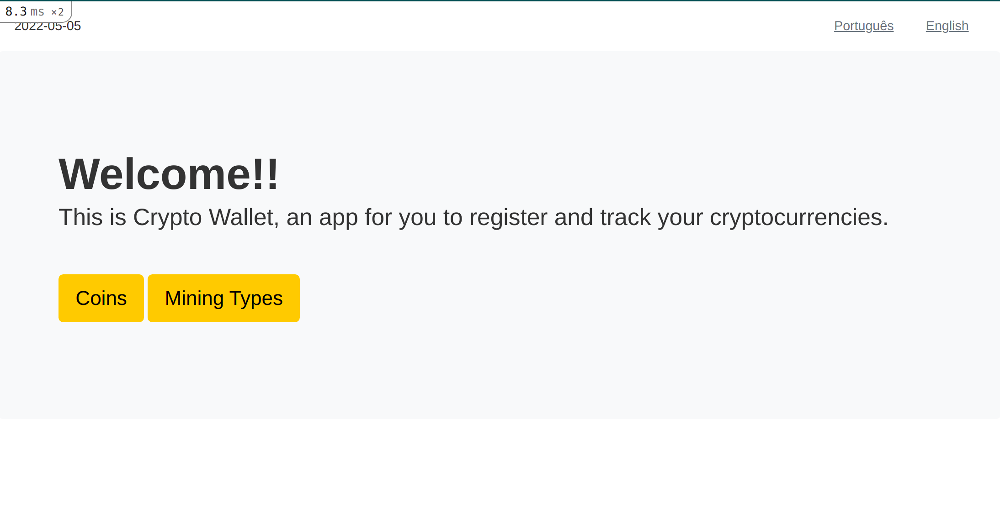
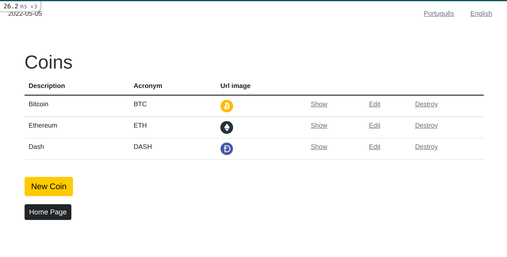
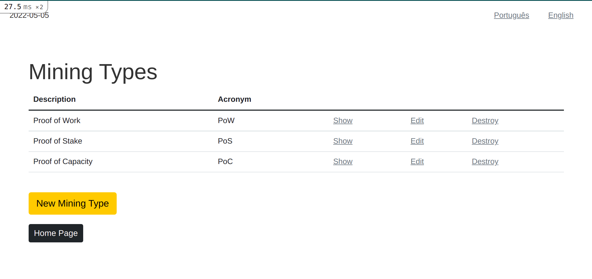

# Crypto Wallet

<strong>Curso:</strong> [Ruby on Rails](https://www.udemy.com/course/rubyonrails-5x/) (Projeto referente ao módulo 3)

<strong>Instrutor:</strong> [Jackson Pires](https://www.linkedin.com/in/jackson-pires/)

<strong>Status:</strong> Concluído :heavy_check_mark:

<br>

<strong>Aprendizados:</strong>
- CRUD
- Fluxo MVC
- Helpers
- Rotas e REST
- Query Params
- Partials
- Rake Tasks
- Internacionalização (i18n)
- Cookies e Sessions
- Assets Pipeline

<br>

# Rodando localmente
<strong>Pré-requisitos:</strong> ter o Rails instalado na sua máquina.
```
gem install rails
```

<br>

1. Clonar o repositório
2. No terminal, rodar o comando `rails s`
3. Acessar http://localhost:3000/



